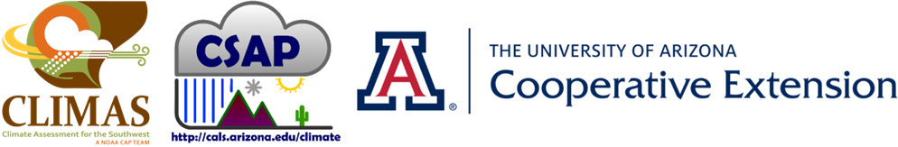

::: {.dashboard-intro}
Key temperature and precipitation indicators for Arizona and New Mexico.

**Data through September 21, 2026** · Reference period: 1991–2020

Explore all maps from Map Browser in the navigation menu.
:::

::: {.dashboard-map-grid}
::: {.dashboard-map-card}
[{fig-alt="Map showing 7-day mean temperature across Arizona and New Mexico"}](pages/products/tmean_percentile_07day.qmd)

::: {.dashboard-card-actions}
[View details](pages/products/tmean_percentile_07day.qmd){.btn .btn-sm .btn-outline-primary}
[Full-resolution PNG](maps/generated/prism/temperature/tmean-percentile-rank-07day-latest.png){.dashboard-full-resolution}
:::
:::

::: {.dashboard-map-card}
[{fig-alt="Map showing 30-day mean temperature across Arizona and New Mexico"}](pages/products/tmean_percentile_30day.qmd)

::: {.dashboard-card-actions}
[View details](pages/products/tmean_percentile_30day.qmd){.btn .btn-sm .btn-outline-primary}
[Full-resolution PNG](maps/generated/prism/temperature/tmean-percentile-rank-30day-latest.png){.dashboard-full-resolution}
:::
:::

::: {.dashboard-map-card}
[{fig-alt="Map showing 30-day percentile rank across Arizona and New Mexico" loading="lazy"}](pages/products/pcpn_percentile_30day.qmd)

::: {.dashboard-card-actions}
[View details](pages/products/pcpn_percentile_30day.qmd){.btn .btn-sm .btn-outline-primary}
[Full-resolution PNG](maps/generated/prism/precipitation/pcpn-percentile-rank-30day-latest.png){.dashboard-full-resolution}
:::
:::

::: {.dashboard-map-card}
[{fig-alt="Map showing 90-day percentile rank across Arizona and New Mexico" loading="lazy"}](pages/products/pcpn_percentile_90day.qmd)

::: {.dashboard-card-actions}
[View details](pages/products/pcpn_percentile_90day.qmd){.btn .btn-sm .btn-outline-primary}
[Full-resolution PNG](maps/generated/prism/precipitation/pcpn-percentile-rank-90day-latest.png){.dashboard-full-resolution}
:::
:::

::: {.dashboard-map-card}
[{fig-alt="Map showing current dry-spell percentile across Arizona and New Mexico" loading="lazy"}](pages/products/pcpn_current_dry_spell_percentile.qmd)

::: {.dashboard-card-actions}
[View details](pages/products/pcpn_current_dry_spell_percentile.qmd){.btn .btn-sm .btn-outline-primary}
[Full-resolution PNG](maps/generated/prism/precipitation/pcpn-current-dry-spell-percentile-rank-latest.png){.dashboard-full-resolution}
:::
:::

::: {.dashboard-map-card}
[{fig-alt="Map showing percentile rank across Arizona and New Mexico" loading="lazy"}](pages/products/pcpn_water_year_percentile.qmd)

::: {.dashboard-card-actions}
[View details](pages/products/pcpn_water_year_percentile.qmd){.btn .btn-sm .btn-outline-primary}
[Full-resolution PNG](maps/generated/prism/precipitation/pcpn-water-year-percentile-rank-latest.png){.dashboard-full-resolution}
:::
:::

:::

::: {.dashboard-note}
Percentile rank compares current conditions with the same time of year in 1991–2020. Low precipitation ranks indicate drier conditions; high temperature ranks indicate warmer conditions. A high dry-spell rank means the ongoing dry spell is unusually long.
:::

::: {.institutional-branding .dashboard-branding}
{fig-alt="Logos for CLIMAS, the Climate Science Applications Program, and University of Arizona Cooperative Extension"}

::: {.dashboard-branding-links}
[Climate Assessment for the Southwest](https://www.climas.arizona.edu/) · [Climate Science Applications Program](https://cales.arizona.edu/climate/) · [University of Arizona Cooperative Extension](https://extension.arizona.edu/topics/climate)
:::

::: {.dashboard-contact}
Mike Crimmins · [crimmins@arizona.edu](mailto:crimmins@arizona.edu)
:::
:::
